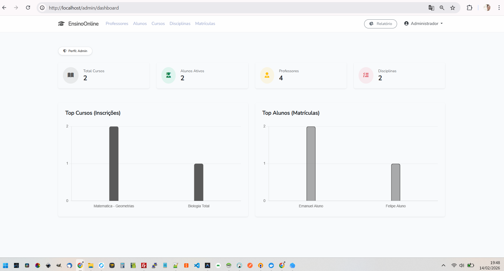
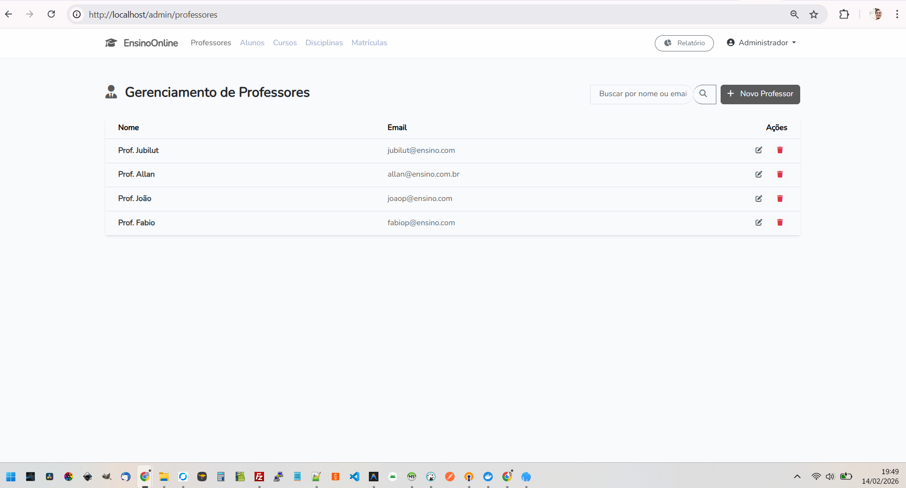
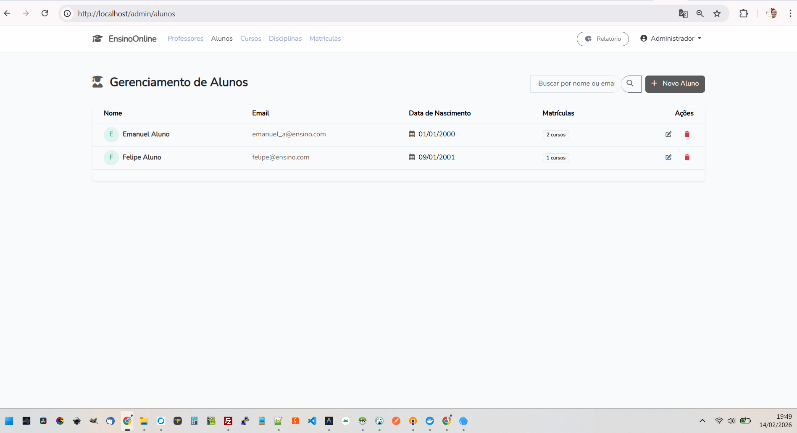
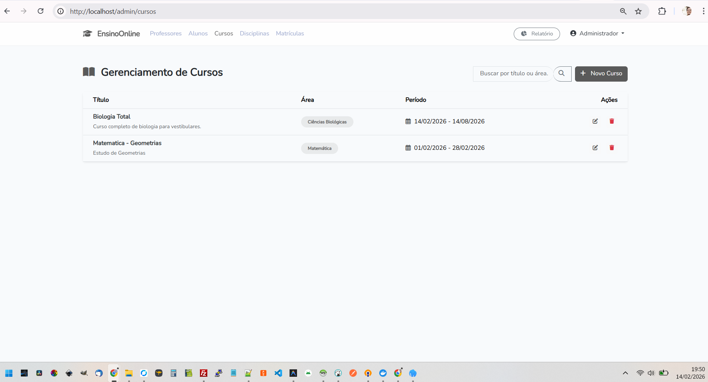
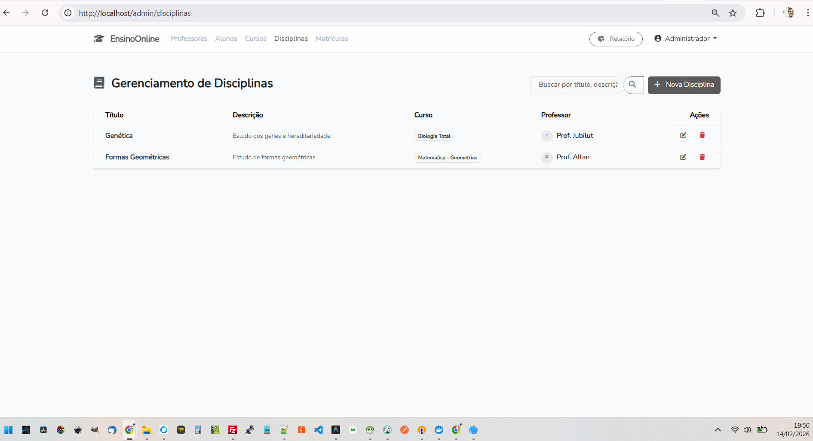
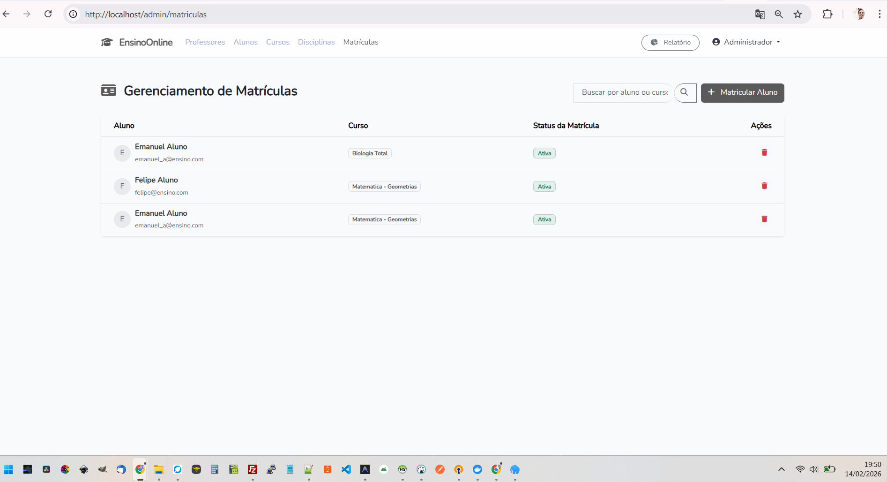
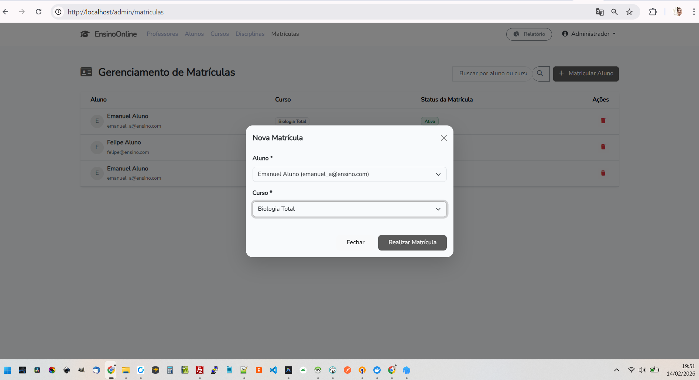
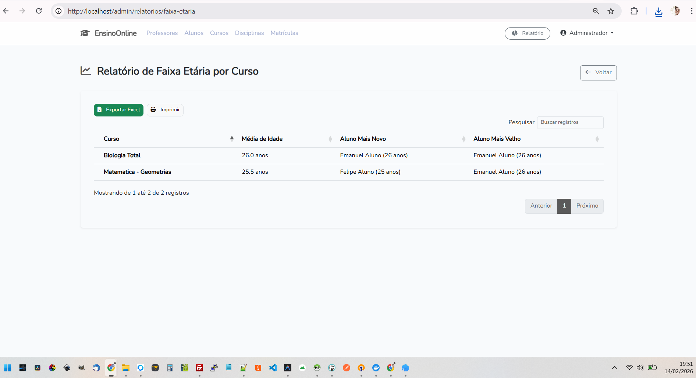

# Portal Administrativo - Ensino Online

## Descrição do Projeto

O **Portal Administrativo - Ensino Online** é um sistema de gestão educacional desenvolvido com as tecnologias mais modernas do ecossistema PHP e Laravel. Seu objetivo é facilitar a administração de cursos, disciplinas, professores e alunos em uma plataforma intuitiva e responsiva.

O sistema permite:
- **Gestão de Alunos:** Matrículas, acompanhamento e cadastro.
- **Gestão de Professores:** Atribuição de disciplinas e cursos.
- **Cursos e Disciplinas:** Organização curricular completa.
- **Dashboard Administrativo:** Visão geral das métricas da escola.
- **Relatórios:** Análise de faixa etária e perfil dos alunos.

A interface foi construída com foco em UX/UI, utilizando componentes modernos e design limpo.

---

## Como Rodar o Projeto

Este projeto utiliza **Laravel Sail** (Docker), o que torna a configuração do ambiente extremamente simples.

### Pré-requisitos
- Git
- Docker Desktop (instalado e rodando)

### Passo a Passo

1. **Clone o repositório:**
   ```bash
   git clone https://github.com/andrecampero/ensinoonline.git
   cd ensinoonline
   ```

2. **Instale as dependências do Composer (caso não tenha o diretório vendor):**
   ```bash
   docker run --rm \
       -u "$(id -u):$(id -g)" \
       -v "$(pwd):/var/www/html" \
       -w /var/www/html \
       laravelsail/php83-composer:latest \
       composer install --ignore-platform-reqs
   ```

3. **Copie o arquivo de ambiente:**
   ```bash
   cp .env.example .env
   ```

4. **Inicie os containers Docker:**
   ```bash
   ./vendor/bin/sail up -d
   # OU diretamente com docker-compose:
   docker-compose up -d
   ```

5. **Gere a chave da aplicação:**
   ```bash
   ./vendor/bin/sail artisan key:generate
   # OU:
   docker-compose exec ensinoonline php artisan key:generate
   ```

6. **Execute as migrações e popule o banco de dados (Seeder):**
   ```bash
   ./vendor/bin/sail artisan migrate:fresh --seed
   # OU:
   docker-compose exec ensinoonline php artisan migrate:fresh --seed
   ```

7. **Instale as dependências do Frontend e compile os assets:**
   ```bash
   ./vendor/bin/sail npm install && ./vendor/bin/sail npm run build
   # OU:
   docker-compose exec ensinoonline npm install
   docker-compose exec ensinoonline npm run build
   ```

8. **Acesse o sistema:**
   Abra seu navegador em: [http://localhost](http://localhost)

---

## Logins de Exemplo

O `DatabaseSeeder` já popula o banco com usuários de teste para cada perfil. A senha padrão para **TODOS** os usuários abaixo é:

### 🛡️ Administrador
- **Email:** `admin@ensino.com`
- **Acesso:** Total ao sistema.

### 👨‍🏫 Professores
- **Prof. Jubilut:** `jubilut@ensino.com` (Disciplinas de Biologia)
- **Prof. Allan:** `allan@ensino.com.br` (Disciplinas de Matemática)
- **Prof. João:** `joaop@ensino.com`
- **Prof. Fabio:** `fabiop@ensino.com`

### 🎓 Alunos
- **Emanuel Aluno:** `emanuel_a@ensino.com`
- **Felipe Aluno:** `felipe@ensino.com`

---

## Observações de Performance

Se estiver rodando em **Windows** via Docker Desktop, recomenda-se fortemente o uso do **WSL2** para hospedar os arquivos do projeto, garantindo uma performance muito superior no carregamento das páginas.

Para otimização imediata em ambiente Windows (filesystem montado), execute:
```bash
./vendor/bin/sail artisan optimize
./vendor/bin/sail artisan view:cache
# OU:
docker-compose exec ensinoonline php artisan optimize
docker-compose exec ensinoonline php artisan view:cache
```

---

## Prints do Portal Administrativo - Ensino Online

Aqui estão algumas capturas de tela das principais funcionalidades do sistema:

### 1. Tela de Login


### 2. Dashboard Principal


### 3. Gerenciamento de Professores


### 4. Cadastro de Professor (Modal)


### 5. Gerenciamento de Alunos


### 6. Gerenciamento de Cursos


### 7. Gerenciamento de Disciplinas


### 8. Gestão de Matrículas


### 9. Realizar Nova Matrícula


### 10. Relatório de Faixa Etária (Média de Idade por Curso)

